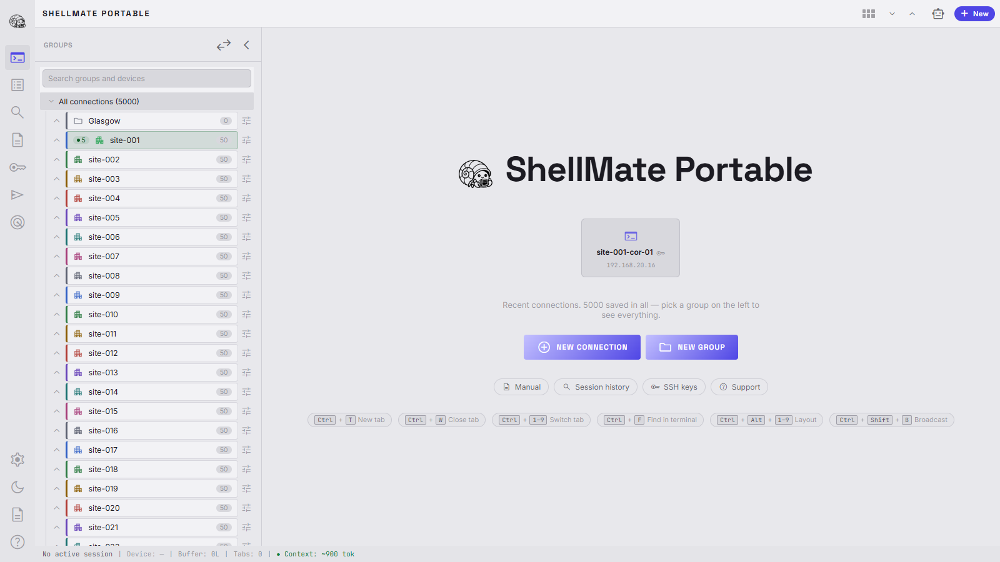
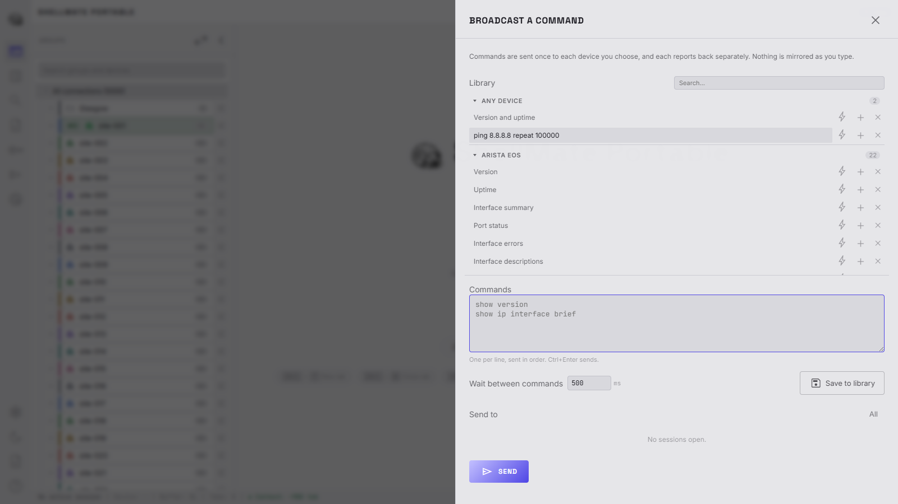
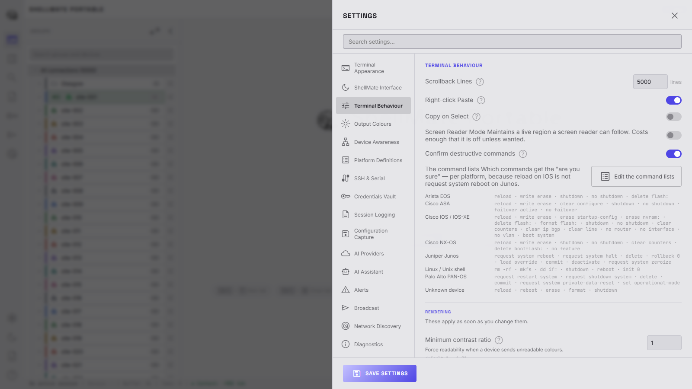
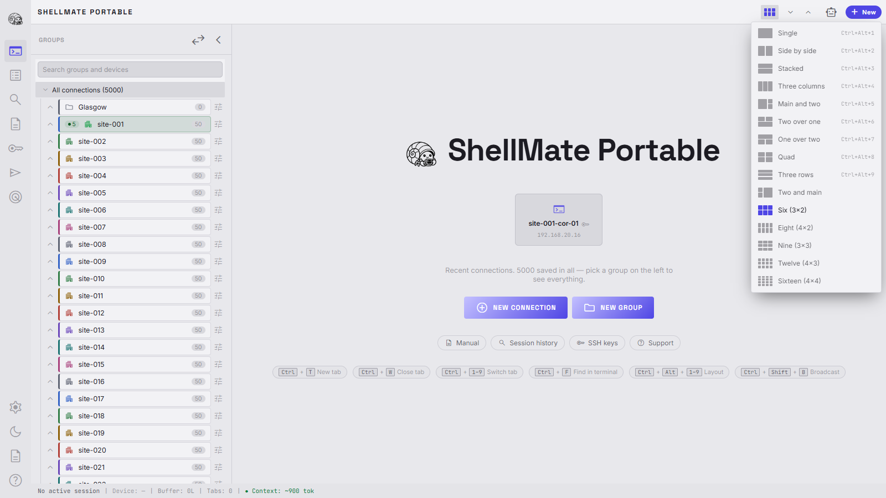

# ShellMate Portable

A split-screen, multi-tab network terminal with a built-in agentic AI copilot. Built for network engineers working with Cisco switches, routers, firewalls and similar devices.

Ships as a **single portable executable** — no Python, no installer, no administrator rights, and no internet access required. Runs from a USB stick on a locked-down corporate machine and carries its settings with it.

> A fork of [ShellMate](https://github.com/sjohnston1972/shellmate), reshaped around portability and a much wider feature set.



## What it does

### Terminal and connections

- **SSH, serial console and telnet** — one tabbed terminal for all three. SSH supports password or key authentication (Ed25519/ECDSA/RSA/DSA, encrypted keys included) and jump-host chaining through a bastion. Serial enumerates the COM ports actually present on the machine and sends break for ROMMON access. Telnet negotiates options properly and can answer login prompts for you
- **Multi-tab terminal** — connect to multiple network devices simultaneously, each in its own tab with an independent session, buffer and WebSocket
- **Split views** — fifteen tile layouts up to a 4×4 grid (`Ctrl+Alt+1`–`9` for the first nine, the rest in the picker), with tabs assigned to panes from their context menu. Sessions in hidden panes keep running and keep their scrollback. Quick text-size arrows sit beside the layout button, so a wall of panes is two clicks from readable
- **Tab management** — drag to reorder, `Ctrl+1–9` shortcuts, `Ctrl+T`/`Ctrl+W`, and a right-click menu that earns its place: reconnect (one tab or all), duplicate, new connection, per-tab colour scheme, keep-alive, copy address/history, disconnect, close tab and close all — closing sends an explicit disconnect to the device before teardown
- **Groups** — organise thousands of saved connections in a collapsible tree with a real root node, colours, icons (picked at creation, site icon first), favourites and nested subgroups. Per-group connect-all/disconnect-all, drag-and-drop membership, and a New Sub-Group button that follows your selection. Right-click the root (or empty space) to create a top-level group; right-click a device for edit, copy/move and delete, or use the hover **×** on its row. Ctrl/shift-click selects several devices at once and a single drag moves them all between groups — or out to the root
- **Names that fix themselves** — a connection saved by IP address is renamed to the device's real hostname the first time you connect, read from its own prompt. Names you typed deliberately are never touched
- **SFTP file browser** — pull a config off a device or push an image to it over the SSH connection the tab already has open. No second login, no separate tool
- **Network discovery** — scan a subnet, range or list, fingerprint what answers, and save the results as connections
- **Smart copy/paste** — `Ctrl+C` (smart — copies selection or passes SIGINT), `Ctrl+Shift+C/V`, right-click paste, and confirmation with chunked pacing for large pastes

### Device awareness and safety

- **Knows what it is talking to** — identifies IOS/IOS-XE, NX-OS, ASA, Junos, PAN-OS, Arista EOS and Linux from the login banner, then adapts: turns paging off with the right command so you stop typing `terminal length 0`, picks the right config command, and shows the platform in the status bar (click it to set the platform yourself). Nothing is sent to a device it cannot confidently identify — and when that happens it says so and names the command it declined to send
- **Cross-vendor aliases** — type `ints` and get `show ip interface brief` on IOS, `show interfaces terse` on Junos, `show interface all` on PAN-OS. The terminal shows what was actually sent
- **Destructive-command confirmation** — `reload`, `write erase` and friends get an "are you sure" before they reach the device. One global switch covers typing and AI suggestions, and every platform's command list is visible and editable in Settings
- **Pending-action alerts** — `reload in 10` and Junos `commit confirmed` are tracked per session with a live countdown on the tab and in the status bar. The countdown arms only when the **device itself confirms** the schedule ("Reload scheduled in 5 minutes by admin"), re-synchronises against its announcements, escalates through flash/tone/toast thresholds, throws an unmissable centre-screen warning at 20 seconds with a jump-to-tab button — and can be dismissed from the status bar when you know better
- **Broadcast** — send a command or sequence to many devices at once, from a vendor-grouped snippet library with per-entry quick-broadcast bolts (electric blue when armed). Saving a command asks which vendor to file it under, right-click edits a saved entry in place (name, commands, vendor, timing), and the vendor groups stay open while you work. Every run confirms exactly what goes to exactly which devices first



### Record, recall, compare

- **Searchable session history** — every session is recorded automatically as structured commands and output. *"What did I change on the Glasgow core last Tuesday"* is a search with a device filter and a date range, not a grep across a folder of log files
- **Session replay** — open any past session and read it back command by command, with the output and how long each took
- **Diff on connect** — every SSH login captures the running config on a second channel, invisibly (falling back to a hidden, announced capture over your own session where a second channel is refused), and compares it against your last visit. If it changed you are *asked* whether you want to see the difference; the diff opens as readable blocks with a copy button on each, legible in both themes. Captures can also be kept as redacted `.cfg` files with retention limits
- **Session logging** — optional per-session file logging with one timestamp per line, an in-app viewer with copy tools, working downloads with a completion toast, and a running total of what the folder weighs. Redaction masks credentials on the way to disk

### The AI copilot

- **AI chat copilot** — Claude, OpenAI, xAI Grok, DeepSeek or local Ollama models see your live terminal output and answer questions about what's on screen. Off until you ask for it, so a fresh install opens with the terminal at full width and no provider configured
- **Live model discovery** — "Test connections & refresh models" asks each provider what it can actually run; the list is cached, restored on every launch, refreshed when a key is saved, and self-heals when a provider retires a model. A refresh button sits beside the picker
- **Session-aware context** — a picker chooses exactly which tabs the AI can see ("compare the BGP tables on tab 1 and tab 3"), and the choice sticks for every request including automatic post-command analysis. The status bar counts the context cost live
- **Command suggestions** — the AI suggests CLI commands you can approve with one click; dangerous commands get a confirmation prompt, and the reply can analyse the output of what you approved
- **Tshoot / Learn mode toggle** — a pill in the chat header flips the AI persona between *Troubleshoot* (terse, fix-it-now) and *Learn* (patient mentor that explains the why)
- **Knowledge-base augmentation (Chroma DB)** — point ShellMate at a Chroma vector store of your design guidelines and matching snippets are auto-retrieved and injected into every AI prompt; silently disabled when not configured
- **Conclude to Jira** — bundle session transcripts + chat into a Jira ticket (or comment on an existing one) with one click

### The chrome

- **One Settings panel** — sixteen sections behind a searchable rail with per-section icons: appearance, terminal behaviour, output colour rules with live preview, seven colour schemes, per-platform definitions, credentials, capture, alerts, AI, broadcast, discovery — plus ~80 advanced values, each bounded, individually marked when off-default, with a Restart button beside the two that need one
- **Toast notifications, your way** — corner, accent colours per severity and duration are all editable, with a live preview button and position changes that apply as you pick them
- **Diagnostics in-app** — version, data folder, log location and history-database counts, with one-click doors to the session logs and a redacted support bundle
- **Encrypted credentials vault** — API keys and remembered device passwords are encrypted on disk, never in plain text. By default they are tied to your Windows account, so a lost USB stick is useless to anyone else; switch to a master password if you need the vault to work on any machine
- **Light / dark theme** — toggle from the sidebar; every surface is token-driven and contrast-checked in both
- **A manual that matches the software** — eleven bundled pages, re-verified against the code, readable offline from the sidebar
- **In-app bug and feature reporting** — a small floating reporter (ShellMate is in active development, and reports genuinely shape it) that files each report as a tagged GitHub issue for review. It sends only what you type plus the Windows version and build type — never anything from your terminal sessions — and on an air-gapped machine it queues the report locally and offers copy-to-clipboard instead



## Tech stack

| Layer | Technology |
|---|---|
| Backend | Python · FastAPI · uvicorn · paramiko · pyserial |
| Frontend | Vanilla JS · xterm.js · HTML/CSS |
| AI | Claude · OpenAI · xAI Grok · DeepSeek · Ollama (local) |
| Knowledge base | Chroma vector DB (optional) |

## Getting started

There are two ways to run ShellMate. Use the **portable executable** if you just
want to use it; use the **source install** if you want to develop it.

### Portable executable (no install, no admin rights)

`ShellMate-Portable.exe` is a single self-contained file. It needs no Python, no installer
and no administrator rights, and it runs happily from a USB stick on a locked-down
corporate machine. All third-party assets are bundled, so it works with no
internet access at all.

Download it, put it wherever you like, and double-click it. It opens as a
**desktop application** — its own window, its own taskbar entry, no browser
chrome — using the WebView2 runtime that ships with Windows 11. There is no
console window; every run writes `ShellMate-Data/shellmate.log` instead.

**Closing the window does not end your sessions.** ShellMate keeps running in
the system tray with every connection alive, which matters when you have shut
the window on a device that is mid-reload. Reopen it from the tray icon, or
choose **Quit** there to stop properly.

If the WebView2 runtime is missing (some older Windows 10 builds), it falls
back to a chromeless Edge window, and then to your default browser. It always
starts. And because the UI is just a local web page, you can always point a
browser at `http://localhost:8765` as well — useful for devtools or a second
view of the same sessions.

Command-line flags, mostly for testing: `--browser` opens the default browser
instead of a window, and `--no-window` serves without opening anything.

On first run it creates a `ShellMate-Data/` folder **next to the executable**
holding your settings, profiles and logs. Everything travels with the exe — move
the folder to another machine and your setup comes with it. If the location it is
run from happens to be read-only (Program Files, a write-protected stick), it
falls back to `%LOCALAPPDATA%\ShellMatePortable` and says so clearly in the console.

To build it yourself, see **Building the executable** below.

### Building the executable

Everything needed to compile `ShellMate-Portable.exe` from a fresh clone, in
order. You need **Windows** (the build targets the WebView2 desktop shell) and
**Python 3.11+** on the PATH — nothing else.

```bash
# 1. Get the source
git clone https://github.com/sjohnston1972/shellmate-portable.git
cd shellmate-portable

# 2. Install the runtime and build dependencies
pip install -r requirements.lock      # exact versions, for a release build
pip install -r requirements-dev.txt   # (or requirements.txt for the floors only)

# 3. (Optional) run the tests — each is a standalone script, and the
#    runner gives the lot one exit code and a summary
python test_vault.py                      # one
python tools/run_tests.py                 # all of them
python tools/run_tests.py --skip phase2,caching   # without the browser ones

# 4. Build
pyinstaller build.spec --noconfirm

# 5. The result
#    -> dist/ShellMate-Portable.exe   (a single self-contained file, ~37 MB)
```

Double-click the result, or copy it to a USB stick — it needs nothing else.
On first run it creates `ShellMate-Data/` beside itself for settings and data.

Worth knowing before you build:

- **Frontend assets are already committed** (`frontend/vendor/` — xterm.js and
  the subsetted icon font), so a build needs no network. Only run
  `python tools/vendor_assets.py` if you are deliberately upgrading those
  assets; it downloads them fresh and re-subsets the icon font.
- **Rebuild after every source change you want in the exe.** The executable is
  a frozen snapshot — editing `backend/` or `frontend/` does nothing to an
  already-built binary.
- **Check the build date if in doubt**: Settings → Diagnostics shows when the
  running copy was built, so a stale exe cannot masquerade as your fix.
- **If corporate antivirus quarantines the single-file build**, set
  `ONEFILE = False` in `build.spec` and rebuild to produce a folder build
  (`dist/ShellMate-Portable/`) instead. It starts faster and is far less
  likely to be flagged.
- The application icon is generated during the build from
  `backend/branding.py`; a failure there costs the icon, never the build.
- **CI does the same on every push** (`.github/workflows/ci.yml`): a Windows
  runner installs `requirements.lock`, runs every test through
  `tools/run_tests.py`, builds the executable and keeps it as an artifact. A
  tag of the form `v1.2.3` also publishes a GitHub release carrying the exe,
  which is what the in-app update check compares itself against.
- **Code signing** happens in that workflow when the repository holds a
  certificate — `SIGN_CERT_PFX_BASE64` and `SIGN_CERT_PASSWORD` as Actions
  secrets. Without them the build is unsigned, which is what corporate
  antivirus objects to; with them, `signtool` signs and timestamps the exe
  before it is kept. The step is in the workflow rather than `build.spec`
  because PyInstaller's `codesign_identity` is macOS-only.

### Source install

#### Requirements

- Python 3.11+
- Network access to an SSH device (or use localhost for testing)
- An API key for at least one of Anthropic, OpenAI, xAI, DeepSeek, **or** [Ollama](https://ollama.ai) running locally
- *(Optional)* a [Chroma](https://www.trychroma.com/) server hosting a `design_guidelines` collection if you want vector-RAG augmentation

#### Install

```bash
git clone https://github.com/sjohnston1972/shellmate-portable.git
cd shellmate-portable
pip install -r requirements.txt
```

Third-party frontend assets (xterm.js, fonts) are committed under
`frontend/vendor/`, so nothing is fetched from a CDN at runtime. To refresh or
upgrade them:

```bash
pip install -r requirements-dev.txt
python tools/vendor_assets.py
```

#### Configure

```bash
cp .env.example .env
# Add your ANTHROPIC_API_KEY (or any of OPENAI_API_KEY, XAI_API_KEY, DEEPSEEK_API_KEY)
# or leave them all blank and use Ollama
```

Anything in `.env` can be overridden at runtime in **Settings → AI Providers** and
**Settings → Knowledge Base (Chroma DB)**. The hierarchy is:

1. Value saved in the Settings panel (stored in `settings.json`) wins
2. Falls back to the matching `.env` variable
3. If neither is set, the provider is simply unavailable

For a Chroma-backed knowledge base, set `CHROMA_URL` (e.g. `http://localhost:8000`)
and `CHROMA_COLLECTION` (defaults to `design_guidelines`). When unset, ShellMate
silently skips the lookup — there's no penalty for leaving it disabled.

#### Run

```bash
python run.py
```

ShellMate starts a local web server and opens your browser to it automatically.
It prefers port 8765 and walks upward if that is already taken, so it will not
fail to start just because something else has the port. Launching it a second
time opens the copy that is already running rather than starting a rival server.

### Where your data lives

| What | Where |
|---|---|
| Settings | `ShellMate-Data/settings.json` |
| Connection profiles | `ShellMate-Data/profiles.json` (never any secret) |
| API keys and saved passwords | `ShellMate-Data/vault.json` (encrypted) |
| Session history and configs | `ShellMate-Data/shellmate.db` (SQLite) |
| Platform definitions | `ShellMate-Data/platforms.json` (yours to edit) |
| Session logs | `ShellMate-Data/logs/` |
| Pre-seeded `.env` | Next to the executable |

### Credentials

Nothing sensitive is written in plain text. API keys and any device passwords
you choose to remember go into an encrypted vault, and connection profiles hold
only the non-secret details needed to reconnect.

Two ways to protect the vault, switchable in **Settings → Credentials Vault**:

| Mode | What it means |
|---|---|
| **Windows account** (default) | Encrypted with your Windows login. Nothing to type, and the file cannot be decrypted by another user or on another machine — a lost stick is inert. Does not travel between accounts. |
| **Master password** | Encrypted with a passphrase (scrypt + AES-GCM). Works on any machine, at the cost of typing it each launch. |

Keys left in plain text by an earlier version are moved into the vault
automatically on first run and blanked from `settings.json`.

Two honest limits. There is **no recovery** for a forgotten master password —
the key is derived from the passphrase and nothing else. And this protects
against a lost USB stick or someone reading files off the disk, not against
malware already running as you, which can ask Windows to decrypt exactly as
ShellMate does. Full-disk encryption remains worth having.

`ShellMate-Data/` sits beside the executable when frozen, and in the repository
root when running from source. Data written by older versions to the project root
is migrated automatically on first run. The current location is always shown at
`GET /api/system/info`.

### Run with Docker

A `Dockerfile` and `docker-compose.yml` are included. The compose file attaches the
container to an external Docker network called `net_core`, so it pairs naturally
with a Cloudflare tunnel or any other reverse-proxy container on the same network.

```bash
cp .env.example .env       # add your keys
docker compose up -d --build
```

The container binds uvicorn to `0.0.0.0:8765`, mounts `./ShellMate-Data`
for persistence, and exposes `8765:8765` for direct local access. To reach an
Ollama instance on the host, set `OLLAMA_HOST=http://host.docker.internal:11434`
(or the LAN IP of the box running Ollama) in `.env`.

If you front the container with a TLS reverse proxy, the WebSocket clients pick
`wss://` automatically — no extra configuration needed.

## Usage

### Your first five minutes

1. **Start ShellMate** — double-click `ShellMate-Portable.exe` (or
   `python run.py` from source). A desktop window opens on the home view.
2. **Connect to a device** — click **New Connection** (or `Ctrl+T`), pick
   SSH/serial/telnet, fill in the address and credentials, and connect. Tick
   *Save this connection* to get a one-click tile for next time; tick
   *Remember these credentials* to skip the password prompt (encrypted vault).
3. **Watch it identify the device** — the status bar names the platform once
   the banner arrives, paging is turned off with the right command (echoed,
   never silent), and the running config is captured for drift comparison on
   your next visit.
4. **Open more tabs and split the screen** — more connections with `Ctrl+T`,
   a layout from the picker beside **New** (`Ctrl+Alt+1`–`9`), tabs assigned
   to panes from their right-click menu.
5. **Organise with groups** — **New Group** on the home view (pick an icon
   and colour), then drag saved connections onto it in the tree. Right-click
   a group for connect-all, subgroups and more.
6. **Turn on the AI when you want it** — click the robot icon in the tab bar,
   add a provider key under **Settings → AI Providers** (or run Ollama
   locally), press **Test connections & refresh models**, and ask about
   whatever is on screen. The sessions pill chooses which tabs it can see.
7. **Find anything later** — **Session history** on the home view searches
   everything you have ever typed, by device and date, with full replay.

Closing the window keeps every session alive in the tray; **Quit** from the
tray icon is the real exit. The full manual lives in the app — the book icon
in the sidebar — and works offline.

### Controls



| Action | How |
|---|---|
| New connection | Click **+ New** in the tab bar, `Ctrl+T`, or right-click a tab or group |
| Quick connect | Click a recent tile on the home view, or a device tile in its group |
| Go home | Click the logo or the **ShellMate Portable** brand |
| Choose a layout | The layout button beside **New**, or `Ctrl+Alt+1`–`9` |
| Terminal text size | The ▲▼ arrows beside the layout button |
| Switch AI mode | Click the **Tshoot/Learn** pill in the chat header |
| Pick AI model | The model dropdown in the chat header — the ↻ beside it re-asks the providers |
| Choose what the AI sees | The sessions pill in the chat header ("Follow the active tab" / "Choose sessions") |
| Switch tab | Click the tab, or `Ctrl+1` – `Ctrl+9` |
| Close tab | Click **×** on the tab, `Ctrl+W`, or right-click → Close tab / Close all tabs |
| Reorder tabs | Drag and drop |
| Broadcast a command | `Ctrl+Shift+B`, or the send icon in the sidebar |
| Ask the AI | Type in the chat panel on the right |
| Run AI-suggested command | Click **Send** on the command block |
| Send the session to Jira | Click **Conclude** in the chat header |
| Copy terminal text | `Ctrl+C` (with selection), or `Ctrl+Shift+C` |
| Paste into terminal | `Ctrl+V` or right-click |
| Dismiss a pending reload | Click the countdown in the status bar |
| Report a bug / request a feature | **Feedback** (bug icon) at the bottom of the sidebar |
| Open settings | Gear icon in the left sidebar |
| Configure provider keys / Chroma | Settings → *AI Providers* and *Knowledge Base (Chroma DB)* |
| Toggle light/dark theme | Moon icon in the left sidebar |

## Project structure

The tree below is a summary. `CLAUDE.md` carries the authoritative one with a
line explaining each module — this is 29 backend modules, 40 frontend scripts
and 35 test suites, so a full listing here would be a second copy to keep in
step and it would lose.

```
shellmate-portable/
├── run.py                     # Entry point — server thread, window on the main thread
├── build.spec                 # PyInstaller definition for the one-file executable
├── tools/
│   ├── vendor_assets.py       # Downloads and subsets frontend assets (build-time)
│   └── collect_licences.py    # Gathers third-party licence texts (build-time)
├── backend/
│   ├── paths.py               # Every filesystem location resolves here
│   ├── app.py                 # FastAPI routes, WebSockets, auth gate
│   ├── auth.py                # Optional token authentication
│   ├── advanced.py            # Stockton — the settings registry
│   ├── vault.py               # Encrypted credential storage
│   ├── profiles.py            # Saved connections and shared credentials
│   ├── platforms.py           # Per-platform commands and aliases (data, not code)
│   ├── fingerprint.py         # Identify vendor/OS/version on connect
│   ├── discovery.py           # Network scanning
│   ├── store.py               # SQLite session history with FTS5
│   ├── configs.py             # Config capture, diff, drift-on-connect
│   ├── desktop.py             # Native window, tray, self-restart
│   ├── feedback.py            # In-app bug/feature reports → GitHub issues
│   ├── session/               # ANSI handling, transcript parsing, buffers, redaction
│   ├── connections/           # ssh / serial / telnet handlers, SFTP, session manager
│   └── ai/                    # Provider clients, router, prompts
├── frontend/
│   ├── index.html
│   ├── css/style.css
│   ├── js/                    # 40 modules — one per panel or concern
│   ├── docs/                  # The bundled manual, including licences/
│   └── vendor/                # xterm.js and fonts — no CDN at runtime
├── relay/                     # Cloudflare Worker that files feedback as issues
└── test_*.py                  # 35 suites: python tools/run_tests.py, or one at a time
```

## Design

ShellMate uses the *Deep Space* design system — dark background, Space Grotesk headlines, Inter UI text, and JetBrains Mono for the terminal. Built to feel like a high-performance instrument, not a SaaS dashboard. A light theme is also available.

## Security

- **No authentication by default, and that is a bargain rather than an oversight.** ShellMate is an interactive SSH client: anyone who reaches the web UI can open sessions to any host the server can route to, read every open session, and browse the filesystem. That is acceptable only while nothing but the local machine can reach the port.
  - `python run.py` binds `127.0.0.1` — the case ShellMate is built for, and nothing changes.
  - **Binding anywhere else requires `SHELLMATE_AUTH_TOKEN`, and ShellMate refuses to start without it.** Not a warning: a hard failure, because a warning in a log nobody reads is how an installation ends up exposed. Set it to a long random string and ShellMate asks for it before opening anything, over both HTTP and WebSockets.
  - The Docker / `docker-compose.yml` path binds `0.0.0.0:8765`, so the token is mandatory there — the compose file will not start without one. A reverse proxy that authenticates in front of it (Cloudflare Access, Tailscale, an SSO-aware proxy) is still worth having; the token is the floor, not the ceiling.
- **Passwords are dropped from memory once the SSH session is open.** They complete the authentication handshake and are then cleared — the long-lived session object holds an empty string in their place.
- **A password is only persisted if you ask for it, and you are told where it went.** Tick *Remember these credentials* and it goes to the encrypted vault. Tick the plaintext option instead and it is written as readable text to `ShellMate-Data/credentials-plaintext.json` — named for exactly what it is, kept out of `profiles.json` so that file stays safe to share, and logged at warning level each time it is used. That option exists because a vault you are locked out of is worse than no vault; think twice on anything shared.
- **The vault** is encrypted with your Windows account by default, so there is nothing to type and a stolen USB stick is inert. A master password is the alternative and travels between machines, at the cost of typing it at startup — with no recovery, deliberately. The whole entry set is one AEAD blob rather than per-entry ciphertext, so entries cannot be swapped or replayed undetected, and which keys exist is not disclosed.
- **Settings → Credentials Vault** lists everything saved, marks which store each one is in, will move a plaintext one into the vault, and lets you change or delete any of them. A plaintext credential can be displayed — it is already readable in a text file — and an encrypted one cannot, at any price.
- **A saved password never reaches the browser.** The interface sends a connection id and the server fills the credential in on its own side, so a remembered password exists only on disk and in memory during the handshake. `SECRET_FIELDS` stops one reaching `profiles.json` whatever a caller passes.
- **API keys** resolve vault → `settings.json` → `.env`. The Settings panel is the preferred place; `update_settings()` diverts them into the vault and blanks them before writing, so they do not land in `settings.json` either.
- **Session buffers** are in memory and cleared on disconnect. Command transcripts are a separate thing and *are* recorded to `ShellMate-Data/shellmate.db` unconditionally — that is the History and drift feature, and it is documented in the manual.
- **Terminal content sent to a cloud AI provider is masked** on the way out by the same redaction that covers session logs. It is pattern matching, so it reduces exposure rather than guaranteeing absence. Ollama sends nothing anywhere.

## Licence

ShellMate is owned by **Foundry Networks and Services**, and is proprietary
software rather than open source. Copyright © 2025–2026 Foundry Networks and
Services. Provided **as is**, without warranty of any kind — and it is a tool
that types commands into live network devices, so that is worth reading rather
than skimming.

Contact **support@foundry-ns.com**.

The bundled manual's **Legal and licences** page carries the full statement,
the warranty disclaimer, a note on what is sent to AI providers, and
attribution for every third-party component in the executable — with each
licence text reproduced in `frontend/docs/licences/`. Regenerate both after
changing a dependency:

```bash
python tools/collect_licences.py
```
